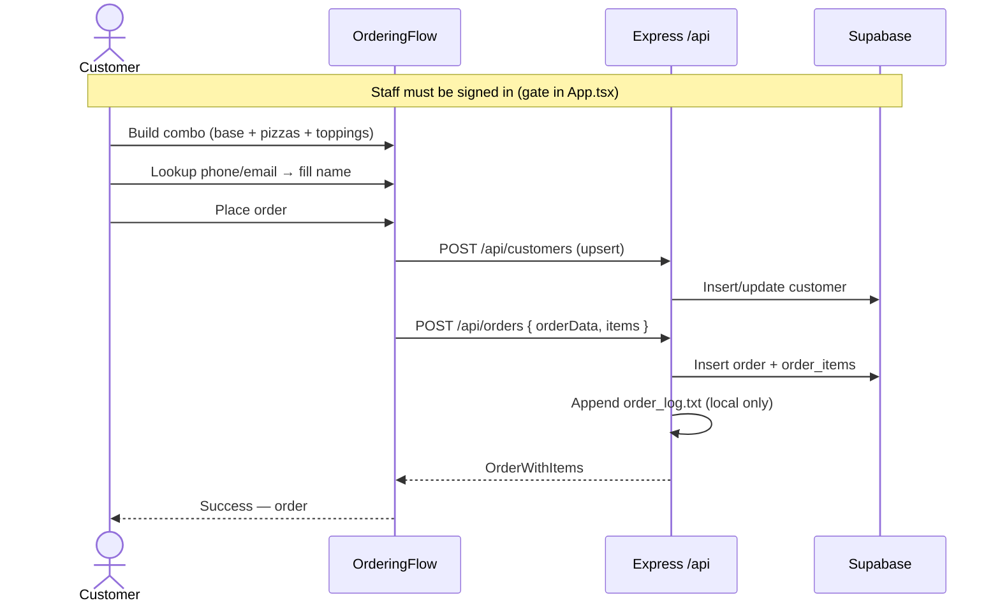
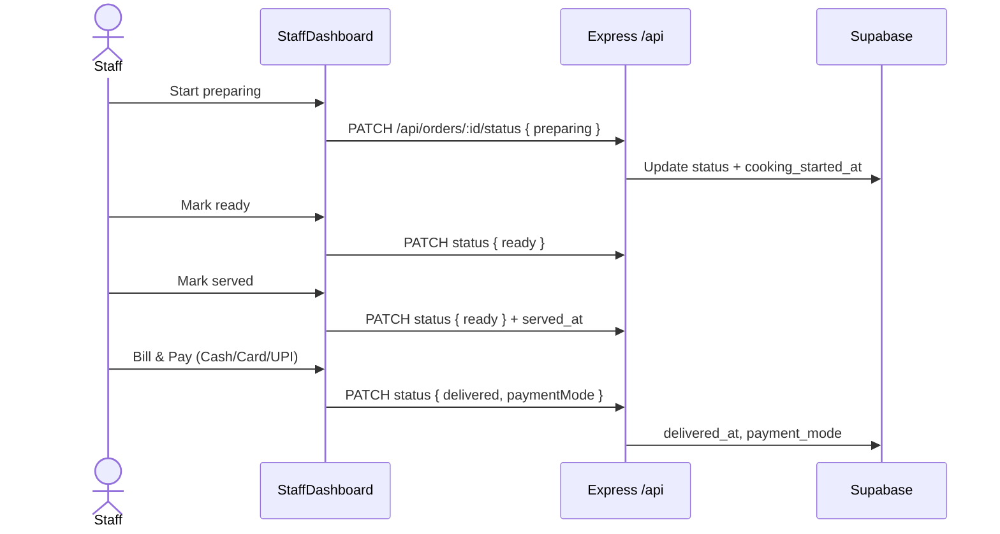
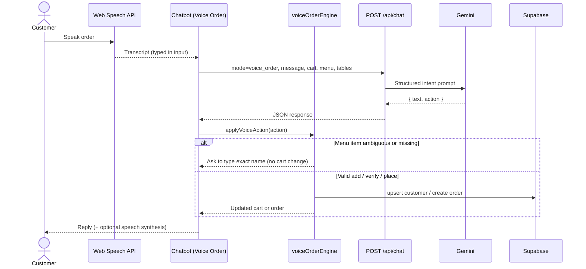
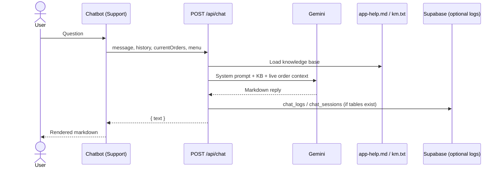
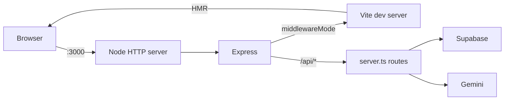
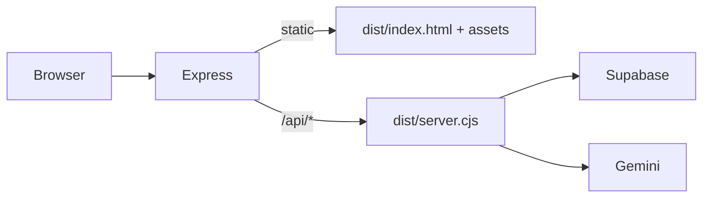
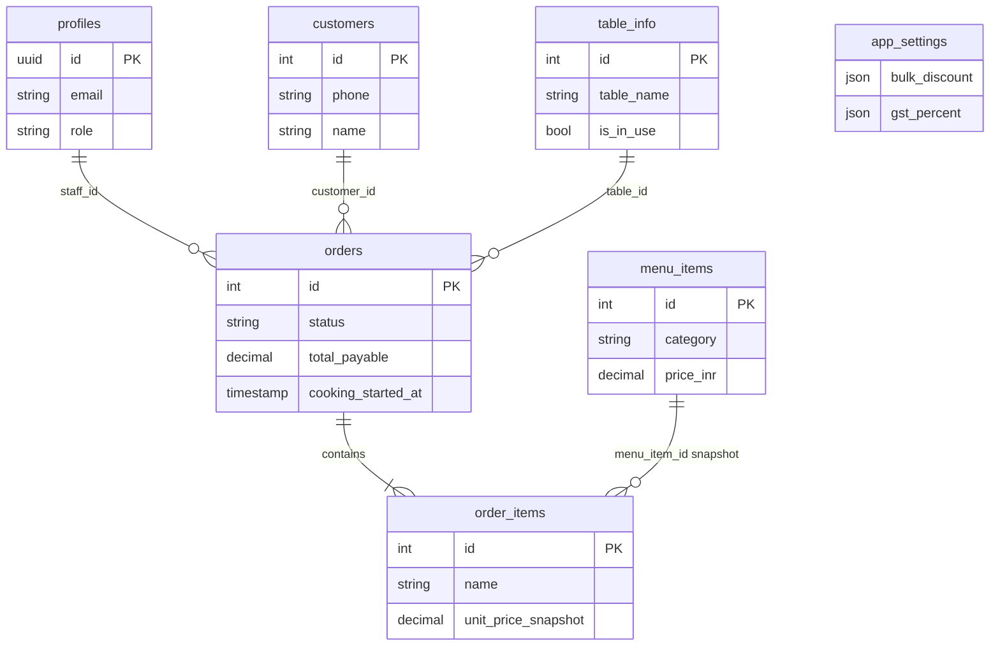

# Slice of Heaven Pizzeria — Design & Architecture

This document describes the system design, technology choices, deployment topology, and key interaction flows for the **Slice of Heaven Pizzeria** dine-in ordering application.

For operational setup and environment variables, see [`docs/setup.md`](../docs/setup.md). For end-user behaviour, see [`docs/app-help.md`](../docs/app-help.md).

---

## 1. System overview

Slice of Heaven is a **single-page web application** backed by an **Express API** and **Supabase (PostgreSQL)**. It supports:

| Actor | Primary capabilities |
|--------|----------------------|
| **Dine-in customer** | Self-order via combo builder or voice assistant; table QR deep-link; order history lookup |
| **Kitchen staff** | Order queue, status transitions, table QR generation, billing & payment |
| **Admin** | Analytics, menu management, user management, app settings |
| **Support assistant** | FAQ / order-status chat powered by Gemini + app help knowledge base |

The app is intentionally **monolithic**: one repository, one Node process in development, one serverless function bundle on Vercel. Business logic for validation and billing lives in shared TypeScript modules used by both client and server where practical.

---

## 2. Technology stack

| Layer | Technology | Role |
|-------|------------|------|
| **UI** | React 19, TypeScript | Component-based SPA |
| **Styling** | Tailwind CSS 4, Lucide icons | “Pizzeria Noir” design system |
| **Charts** | Recharts | Admin analytics visualisations |
| **Markdown** | react-markdown, remark-gfm | Help docs & chat rendering |
| **Build (client)** | Vite 6 | Dev HMR + production bundle → `dist/` |
| **Runtime (server)** | Express 4, Node 18+ | REST API `/api/*` |
| **Dev orchestration** | tsx | Runs `server.ts` with Vite middleware in dev |
| **Production bundle (server)** | esbuild | Bundles `server.ts` → `dist/server.cjs` (CJS, external deps) |
| **Database** | Supabase (PostgreSQL) | Orders, menu, customers, tables, settings, profiles |
| **Auth (staff/admin)** | Supabase Auth | Email/password; first-login password change |
| **AI assistant** | Google Gemini (`@google/genai`, model `gemini-3.5-flash`) | Support chat + voice-order intent parsing |
| **Speech (client)** | Web Speech API | Browser speech-to-text for voice ordering |
| **Email (optional)** | Resend API | Staff welcome / temporary password delivery |
| **Deploy (optional)** | Vercel | Static UI + serverless API |

---

## 3. Logical architecture

```mermaid
flowchart TB
  subgraph Client["Browser (React SPA)"]
    App[App.tsx — role router]
    OF[OrderingFlow]
    SD[StaffDashboard]
    AD[AdminDashboard]
    CB[Chatbot — Support + Voice Order]
    AH[AppHelp]
    DS[dbService — API client]
    VO[voiceOrderEngine — cart & validation]
    App --> OF & SD & AD & CB & AH
    OF & SD & AD & CB --> DS
    CB --> VO
  end

  subgraph Server["Express API (server.ts)"]
    API["/api/* REST handlers"]
    VAL[inputValidation]
    MI[menuImport]
    AS[appSettings / calcBillTotals]
    KB[Knowledge base — app-help.md → km.txt]
    API --> VAL & MI & AS & KB
  end

  subgraph External["External services"]
    SB[(Supabase PostgreSQL + Auth)]
    GM[Gemini API]
    RS[Resend — optional]
  end

  DS -->|fetch JSON| API
  API -->|service role| SB
  API --> GM
  API --> RS
  Client -->|Web Speech API| Client
```



**Request path (typical):** React component → `dbService.api()` → Express route → Supabase (service role) → JSON response → React state update.

**Why not direct Supabase from the browser for data?** All mutating and sensitive reads go through the API using the **service role key** on the server. The browser only receives the **anon key** (for staff auth). This keeps RLS bypass and business rules centralised on the server.

---

## 4. Component diagram

```mermaid
flowchart LR
  subgraph Presentation["Presentation layer"]
    direction TB
    App.tsx
    OrderingFlow.tsx
    StaffDashboard.tsx
    AdminDashboard.tsx
    Chatbot.tsx
    AppHelp.tsx
    BillSummary.tsx
  end

  subgraph Application["Application / domain layer"]
    direction TB
    dbService.ts
    voiceOrderEngine.ts
    orderUtils.ts
    appSettings.ts
    inputValidation.ts
    menuImport.ts
    useSpeechRecognition.ts
  end

  subgraph Infrastructure["Infrastructure layer"]
    direction TB
    server.ts
    supabaseClient.ts
    api/index.js
  end

  Presentation --> Application
  Application --> Infrastructure
```



### Component responsibilities

| Component | Responsibility |
|-----------|----------------|
| **App.tsx** | Global state (orders, menu, tables, settings); staff session; role tabs; QR `?table=N` routing |
| **OrderingFlow.tsx** | Combo builder cart, customer lookup, checkout, order history |
| **StaffDashboard.tsx** | Kitchen queue, status machine, QR links, bill & pay modal |
| **AdminDashboard.tsx** | Analytics, menu CRUD/import, user invites, settings |
| **Chatbot.tsx** | Support chat; voice order UI; mic + cart panel; admin KB upload |
| **AppHelp.tsx** | Searchable in-app help (from `docs/app-help.md`) |
| **dbService.ts** | Typed HTTP client for all `/api/*` endpoints |
| **voiceOrderEngine.ts** | Deterministic cart actions, strict menu matching, polite declines |
| **server.ts** | API routes, Gemini integration, menu bootstrap, order logging |

---

## 5. Interaction diagrams

### 5.1 Customer self-ordering (UI flow)



### 5.2 Staff kitchen & billing



**Order status model:**

```
confirmed → preparing → ready → (served) → ready_to_bill → delivered
                ↘ cancelled (with reason)
```

UI maps `ready + served_at` to display status **ready_to_bill**. Revenue analytics count only **delivered** orders.

### 5.3 Voice ordering (speech → assistant → cart)



**Design split:** Gemini interprets natural language; **voiceOrderEngine** executes cart changes with **strict menu matching** so the model cannot hallucinate items into the cart.

### 5.4 Support chat



---

## 6. Deployment architecture

### 6.1 Local development



- Command: `npm run dev` → `tsx server.ts`
- Single port **3000**; Vite attached as middleware (not a separate port)
- Writable paths: project root (`output/order_log.txt`, `km.txt` cache)

### 6.2 Production — Node server



- Command: `npm run build && npm start`
- Suitable for Railway, Render, Fly.io, VM

### 6.3 Production — Vercel (serverless)

```mermaid
flowchart TB
  Browser --> VercelEdge[Vercel CDN]
  VercelEdge -->|static files| Dist[dist/]
  VercelEdge -->|/api/* rewrite| Fn[api/index.js]
  Fn -->|require| ServerCJS[dist/server.cjs]
  ServerCJS -->|handler export| Express
  Express --> Supabase & Gemini
  ServerCJS --> Tmp[/tmp/pizzeria — km.txt only]
```

| Aspect | Local / Node | Vercel serverless |
|--------|--------------|-------------------|
| UI | Vite dev or `dist/` static | `dist/` static |
| API | Long-lived Express | Cold-start function (30s max) |
| Order log file | `output/order_log.txt` | Skipped (read-only FS) |
| KB cache | `./km.txt` or `/tmp/pizzeria/km.txt` | `/tmp/pizzeria/km.txt` |
| Menu seed files | `input_data/*.txt` | Bundled via `includeFiles` in `vercel.json` |

Entry chain: `vercel.json` rewrites → `api/index.js` → `dist/server.cjs` → exported `handler()`.

---

## 7. Data architecture

### 7.1 Core entities



### 7.2 Menu bootstrap

On startup, `server.ts` reads semicolon-delimited files from `input_data/`:

- `Types_of_Base.txt`
- `Types_of_Pizza.txt`
- `Types_of_Toppings.txt`

(CSV fallbacks: `bases.csv`, `pizzas.csv`, `toppings.csv`.)

Rows are validated, upserted into `menu_items`, and status is exposed at `GET /api/startup/menu-load`. Admins can re-import via dashboard or `POST /api/menu/reload-input-data`.

### 7.3 Billing calculation

Shared logic in `src/lib/appSettings.ts`:

1. **Subtotal** — sum of line items (combo = base + pizzas × qty + toppings × qty)
2. **Bulk discount** — if pizza count ≥ `bulk_discount_min_qty`, apply `bulk_discount_percent`
3. **GST** — applied to taxable amount after discount
4. **Total payable** — subtotal − discount + GST

Prices are **snapshotted** on `order_items.unit_price_snapshot` at order time so historical bills stay correct if menu prices change.

---

## 8. API surface (summary)

| Group | Endpoints | Notes |
|-------|-----------|-------|
| **Config** | `GET /api/config` | Public anon key + Gemini flag |
| **Menu** | `GET/POST/PATCH /api/menu`, reload, startup status | Admin mutations assert admin profile |
| **Orders** | `GET/POST /api/orders`, `PATCH .../status` | Status machine + timestamps |
| **Customers** | CRUD + lookup | Used at checkout & voice verify |
| **Tables** | `GET /api/tables`, usage patch | Dine-in seating |
| **Settings** | `GET/PATCH /api/settings` | GST, bulk discount, currency |
| **Staff** | `POST /api/staff/invite`, profiles | Supabase Auth user creation |
| **Chat** | `POST /api/chat`, session, verify-customer, analytics | `mode=voice_order` for ordering |
| **Help** | `GET /api/app-help`, km-status, km-upload | KB for assistant |

Unmatched `/api/*` returns JSON 404 (never SPA HTML) to keep `dbService` parsing reliable.

---

## 9. Security & access control

| Concern | Approach |
|---------|----------|
| **Staff authentication** | Supabase Auth in browser; session gates staff/admin/customer ordering tabs |
| **Data mutations** | Server uses **service role**; anon key not sufficient for order writes |
| **Admin operations** | `assertAdminProfile(staffId)` on sensitive routes |
| **Customer PII** | Validated server-side (`inputValidation.ts`); phone format enforced (Indian 10-digit) |
| **Secrets** | `GEMINI_API_KEY`, `SUPABASE_SERVICE_ROLE_KEY` server-only; never in client bundle |
| **AI safety** | Voice engine rejects ambiguous menu matches; declines out-of-scope requests (delivery, refunds) |

Staff must be logged in before customers can place orders — intentional operational gate so the kitchen is “open.”

---

## 10. Key design decisions & rationale

### 10.1 Monolithic Express + React (not separate BFF microservices)

**Decision:** Single repo; Express serves API and static/Vite UI.

**Rationale:** Small team / demo scope; shared TypeScript validation; simpler deploy. Trade-off: scale API and UI together.

### 10.2 Server-side data access via REST (not direct Supabase reads for orders)

**Decision:** `dbService` calls `/api/*`; server holds service role.

**Rationale:** Centralises validation, order logging, admin checks, and Gemini context assembly. Prevents client tampering with prices or status.

### 10.3 Combo-based ordering model

**Decision:** Orders are built as **combos** (one base + N pizzas + toppings), not flat SKU-only cart.

**Rationale:** Matches pizzeria domain (choose crust, then pizza, then extras). Each combo expands to multiple `order_items` rows with snapshots.

### 10.4 Voice order: AI interprets, engine executes

**Decision:** Gemini returns `{ text, action }`; `voiceOrderEngine` applies cart changes with strict matching.

**Rationale:** LLMs are good at language but unreliable for inventory/pricing. Deterministic execution prevents wrong items and supports “please type it in” UX.

### 10.5 Browser speech-to-text (not cloud STT)

**Decision:** Web Speech API on client; transcript sent as text to same `/api/chat` agent.

**Rationale:** Zero extra cost/latency; works offline from STT perspective. Trade-off: Chrome/Edge best supported; accuracy varies — mitigated by asking users to type when unclear.

### 10.6 Knowledge base from app-help.md

**Decision:** `docs/app-help.md` synced to `km.txt` at startup; optional admin override upload.

**Rationale:** Single source of truth for Help tab and support bot; ops can update markdown without redeploying prompts.

### 10.7 Dual hosting: long-lived Node vs Vercel serverless

**Decision:** `export handler` for Vercel; `startServer()` for local/VM.

**Rationale:** Demo-friendly Vercel deploy while keeping full filesystem features locally (order log). `/tmp` abstraction for serverless writables.

### 10.8 Revenue analytics on delivered orders only

**Decision:** Gross sales = `status === 'delivered'`; pipeline value = open orders.

**Rationale:** Avoid counting cancelled or in-flight orders as revenue; matches real cash collection at bill & pay.

### 10.9 Table QR deep links (`?table=N`)

**Decision:** URL param locks customer to a table; reduces wrong-table orders.

**Rationale:** Staff generates QR from dashboard; customer lands directly in ordering flow for that table.

---

## 11. Repository layout

```
pizzeria/
├── api/index.js              # Vercel serverless entry
├── design/
│   └── architecture.md       # This document
├── docs/
│   ├── app-help.md           # Functional help + chatbot KB source
│   └── setup.md              # Dev/deploy instructions
├── input_data/               # Menu seed files (.txt / .csv)
├── output/                   # order_log.txt (local only)
├── public/                   # Static assets (favicon)
├── server.ts                 # Express app + API + bootstrap
├── src/
│   ├── App.tsx               # Shell & role routing
│   ├── components/           # UI modules
│   ├── hooks/                # useSpeechRecognition
│   ├── lib/                  # Domain & API client
│   └── types.ts              # Shared interfaces
├── vercel.json
├── vite.config.ts
└── package.json
```

---

## 12. External dependencies & failure modes

| Dependency | If unavailable |
|------------|----------------|
| **Supabase** | App shows login/config error; no orders persist |
| **Gemini** | Support/voice AI disabled; voice flow falls back to local phrase parsing + typed input |
| **Resend** | Staff invite still works; credentials shown in admin UI instead of email |
| **Web Speech API** | Mic disabled; typing still works in Chatbot |

---

## 13. Future extension points

- **Real-time kitchen board** — Supabase Realtime subscriptions on `orders` (currently polling/refresh)
- **Dedicated STT** — Cloud speech for better accuracy in noisy restaurants
- **RLS hardening** — Move from service-role-only to row-level policies with JWT claims
- **Multi-location** — Tenant id on orders/settings; separate menu per branch
- **Payment gateway** — Integrate UPI/Card APIs at `ready_to_bill` instead of manual staff confirmation

---

## 14. Related documents

| Document | Audience |
|----------|----------|
| [`docs/setup.md`](../docs/setup.md) | Developers — install, env vars, Vercel |
| [`docs/app-help.md`](../docs/app-help.md) | Staff, admin, customers — how to use the app |
| [`.env.example`](../.env.example) | Required and optional secrets |

---

*Last updated to reflect voice ordering, Vercel serverless deployment, and unified `/api/chat` assistant architecture.*
